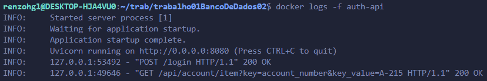
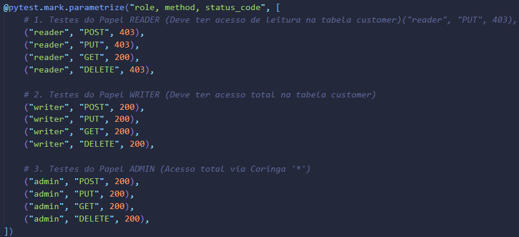

# 🛡️ Sistema de Autenticação e Autorização (RBAC) com FastAPI e DynamoDB

## 📖 Descrição do Projeto

Este repositório contém um serviço de API RESTful para gerenciamento de dados, implementado com **FastAPI** e utilizando o **DynamoDB** (localmente) para persistência. O sistema implementa um modelo de **Controle de Acesso Baseado em Papéis (RBAC - Role-Based Access Control)** para proteger os endpoints e os recursos de dados (tabelas).

### 🔑 Funcionalidades Principais

* **Autenticação JWT:** Geração e validação de tokens JWT para login seguro.
* **Autorização Dinâmica:** Validação de permissões (`table:action`, ex.: `customer:read`) baseada no papel do usuário, consultadas diretamente nas tabelas de configuração (`roles`).
* **Tabelas de Configuração:** Gerenciamento isolado das tabelas sensíveis (`users` e `roles`).
* **Testes de Segurança:** Suíte completa de testes de integração (`pytest`) para matrizes de autorização (36 testes).

---

## 🚀 Como Executar o Projeto Localmente

Para iniciar o ambiente, você precisará ter o **Docker** e o **Docker Compose** instalados.

### 1. Inicialização do Ambiente

O arquivo `docker-compose.yml` inicia a API (`auth-api`) e uma instância local do DynamoDB (DynamoDB Local) com o setup inicial de dados (usuários e papéis).


```bash
docker compose up --build
```

- A versão admin estará acessível em http://localhost:8001.


- A documentação interativa da API (Swagger UI) está em http://localhost:8080/docs.


### 2. Acessar Logs da API
Para acompanhar o funcionamento da API em tempo real:

```bash
docker logs -f auth-api
```

## 🔐 Exemplos de Autenticação e Privilégios (CURL)
Use os tokens obtidos no endpoint **/login** para acessar os recursos protegidos.

### Papéis e Credenciais de Teste
| Papel | Username | Senha | Permissões nas Tabelas de dados | Permissões nas tabelas `users`/`roles` |
| :--- | :--- | :--- | :--- | :--- |
| **admin** | `admin1` | `AdminPass1` | `*` (Acesso Total) | `*` (Acesso Total) |
| **writer** | `writer1` | `WriterPass1` | `write`, `update`, `delete`, `read` | Nenhuma (`403 Forbidden`) |
| **reader** | `reader1` | `ReaderPass1` | `read` | Nenhuma (`403 Forbidden`) |

## 1. Container da API com autorização
Execute o comando a seguir para entrar no container da API para realização dos testes.

```
docker exec -it auth-api sh
```

## 2. Uso do login e export para facilitar execução dos exemplos
### 2.1 Execute o login
```
curl -X POST "http://localhost:8080/login" \
     -H "Content-Type: application/json" \
     -d '{"username": "reader2", "password": "ReaderPass2"}'
```
#### Resposta:
```
{"access_token":"eyJhbGciO.....","token_type":"bearer"}
```
### 2.2 Utilize export
Use export para facilitar reuso do token de acesso nos testes. **OBS:Deve ser executado a cada login**
```
export AUTH_TOKEN="eyJhbGciO....."
```





## 3. Exemplos do **reader**

### Reader - Login
```
curl -X POST "http://localhost:8080/login" \
     -H "Content-Type: application/json" \
     -d '{"username": "reader1", "password": "ReaderPass1"}'
```

### Reader - GET
```
curl -X GET "http://localhost:8080/api/branch/item?key=branch_name&key_value=North%20Town" \
     -H "Authorization: Bearer $AUTH_TOKEN"
```
#### Resposta:
```
{"branch_city":"Rye","branch_name":"North Town","assets":3700000}
```

### Reader - POST proibido
```
curl -X POST "http://localhost:8080/api/customer/item" \
     -H "Authorization: Bearer $AUTH_TOKEN" \
     -H "Content-Type: application/json" \
     -d '{
           "key": {"customer_name": "Bob"},
           "attributes": {"customer_city": "London"}
         }'
```
#### Resposta:
```
{"detail":"Usuário não autorizado: Necessária permissão 'customer:write'."}
```

## 4. Exemplos do **writer** (GET, POST, UPDATE, DELETE)

### Writer - Login
```
curl -X POST "http://localhost:8080/login" \
	-H "Content-Type: application/json" \
	-d '{"username": "writer1", "password": "WriterPass1"}'
```

### Writer - POST (PutItem)
```
curl -X POST "http://localhost:8080/api/customer/item" \
     -H "Authorization: Bearer $AUTH_TOKEN" \
     -H "Content-Type: application/json" \
     -d '{
           "key": {"customer_name": "Bob"},
           "attributes": {"customer_city": "London"}
         }'
```

### Writer - GET
```
curl -X GET "http://localhost:8080/api/customer/item?key=customer_name&key_value=Bob" \
     -H "Authorization: Bearer $AUTH_TOKEN"
```
#### Resposta:
```
{"customer_name":"Bob","customer_city":"London"}
```

### Writer - UPDATE
```
curl -X POST "http://localhost:8080/api/customer/item" \
     -H "Authorization: Bearer $AUTH_TOKEN" \
     -H "Content-Type: application/json" \
     -d '{"key": {"customer_name": "Bob"}, "attributes": {"customer_city": "Paris", "customer_street": "The French street"}}'
```

### Writer - GET
```
curl -X GET "http://localhost:8080/api/customer/item?key=customer_name&key_value=Bob" \
     -H "Authorization: Bearer $AUTH_TOKEN"
```
#### Resposta:
```
{"customer_name":"Bob","customer_city":"Paris","customer_street":"The French street"}
```

### Writer - DELETE
```
curl -X DELETE "http://localhost:8080/api/customer/item?key=customer_name&key_value=Bob" \
     -H "Authorization: Bearer $AUTH_TOKEN"
```

### Writer - GET
```
curl -X GET "http://localhost:8080/api/customer/item?key=customer_name&key_value=Bob" \
     -H "Authorization: Bearer $AUTH_TOKEN"
```
#### Resposta:
```
{"detail":"Item não encontrado na tabela customer."}
```


## 5. Exemplos do **writer** — Tabelas sensíveis (users e roles)

### Users
```
curl -X GET "http://localhost:8080/api/users/item?key=username&key_value=admin1" \
     -H "Authorization: Bearer $AUTH_TOKEN"
```
#### Resposta:
```
{"detail":"Usuário não autorizado: Necessária permissão 'users:read'."}
```

### Roles
```
curl -X GET "http://localhost:8080/api/roles/item?key=role_name&key_value=admin1" \
     -H "Authorization: Bearer $AUTH_TOKEN"
```
#### Resposta:
```
{"detail":"Usuário não autorizado: Necessária permissão 'roles:read'."}
```

## 6. Exemplos do **admin** — POST nas tabelas users e roles

### Login
```
curl -X POST "http://localhost:8080/login" \
     -H "Content-Type: application/json" \
     -d '{"username": "admin1", "password": "AdminPass1"}'
```

### POST em users
```
curl -X POST "http://localhost:8080/api/users/item" \
     -H "Authorization: Bearer $AUTH_TOKEN" \
     -H "Content-Type: application/json" \
     -d '{"key": {"username": "newuser"}, "attributes": {"password": "Pass123", "role_name": "reader"}}'
```

### GET em users
```
curl -X GET "http://localhost:8080/api/users/item?key=username&key_value=newuser" \
     -H "Authorization: Bearer $AUTH_TOKEN"
```
#### Resposta:
```
{"role_name":"reader","password":"Pass123","username":"newuser"}
```

### POST em roles
```
curl -X POST "http://localhost:8080/api/roles/item" \
     -H "Authorization: Bearer $AUTH_TOKEN" \
     -H "Content-Type: application/json" \
     -d '{"key": {"role_name": "auditor"}, "attributes": {"permissions": ["customer:read"]}}'
```
### GET em roles
```
curl -X GET "http://localhost:8080/api/roles/item?key=role_name&key_value=auditor" \
     -H "Authorization: Bearer $AUTH_TOKEN"
```
#### Resposta:
```
{"role_name":"auditor","permissions":["customer:read"]}
```

## 🧪 Instruções de Uso e Testes (Pytest)

### 1. Executando a Suíte de Testes
Execute a suíte completa de testes de integração dentro do contêiner da API. Estes testes validam todas as permissões de crude, além da permissão das tabelas sensíveis que representam as restrições de acesso (**users**, **roles**).

```
docker exec auth-api sh -c "python -m pytest /app/test_auth.py"
```
#### Saída Esperada:

```
============================= test session starts ==============================
platform linux -- Python 3.10.19, pytest-9.0.1, pluggy-1.6.0
rootdir: /app
plugins: anyio-4.11.0
collected 36 items

test_auth.py ....................................                     
   [100%]

============================== 36 passed in 1.38s ==============================
```



## Licença
Distribuído por meio da licença GNU. Veja [LICENSE](./LICENSE) para mais informações.