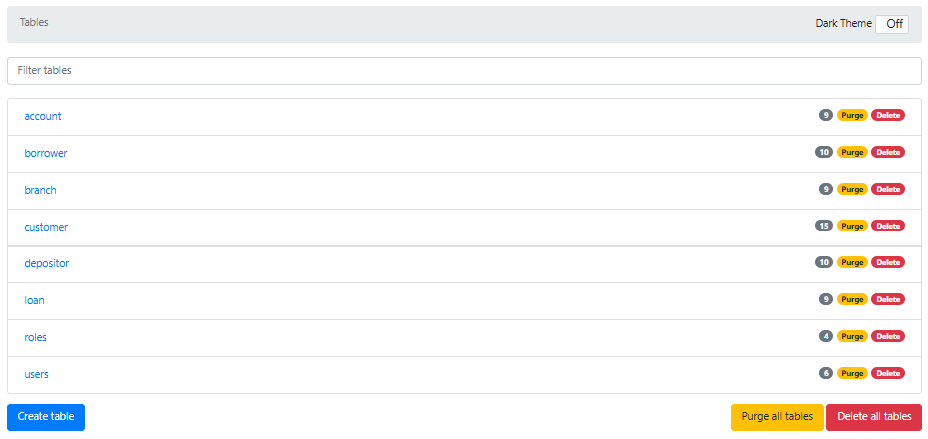
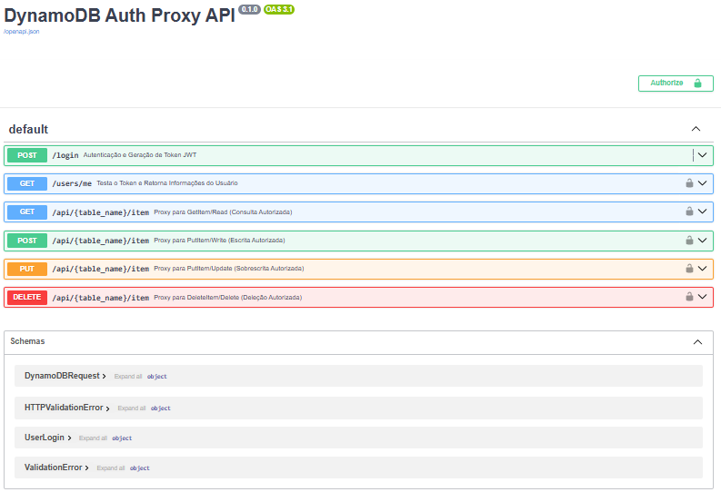
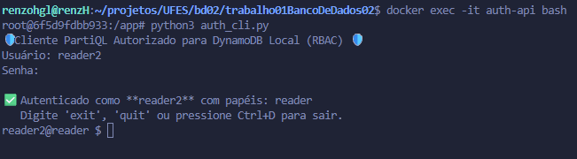

# 🛡️ Sistema de Autenticação e Autorização (RBAC) com FastAPI e DynamoDB

## 📖 Descrição do Projeto

Este repositório contém um serviço de API RESTful para gerenciamento de dados, implementado com **FastAPI** e utilizando o **DynamoDB** (localmente) para persistência. O sistema implementa um modelo de **Controle de Acesso Baseado em Papéis (RBAC - Role-Based Access Control)** para proteger os endpoints e os recursos de dados (tabelas).

### 🔑 Funcionalidades Principais

* **Autenticação JWT:** Geração e validação de tokens JWT para login seguro.
* **Autorização Dinâmica:** Validação de permissões (`table:action`, ex.: `customer:read`) baseada no papel do usuário, consultadas diretamente nas tabelas de configuração (`roles`).
* **Tabelas de Configuração:** Gerenciamento isolado das tabelas sensíveis (`users` e `roles`).
* **Testes de Segurança:** Suíte completa de testes de integração (`pytest`) com 37 casos de teste que validam toda a matriz de autorização (CRUD e acesso sensível) para API e CLI.

---

## 🚀 Como Executar o Projeto Localmente

Para iniciar o ambiente, você precisará ter o **Docker** e o **Docker Compose** instalados.

### 1. Inicialização do Ambiente

O arquivo `docker-compose.yml` inicia a API (`auth-api`) e uma instância local do DynamoDB (DynamoDB Local) com o setup inicial de dados (usuários e papéis).


```bash
docker compose up --build
```

- A versão admin estará acessível em http://localhost:8001.


|  |
|:---------------------------------:|
| *Captura de tela do painel admin, permitindo CRUDE em todas as tabelas* |


- A documentação interativa da API (Swagger UI) está em http://localhost:8080/docs.


|  |
|:---------------------------------:|
| *Captura de tela da documentação interativa* |

### 2. Acessar Logs da API
Para acompanhar o funcionamento da API em tempo real:

```bash
docker logs -f auth-api
```

## 🔐 Exemplos de Autenticação e Privilégios

### Papéis e Credenciais de Teste
| Papel | Username | Senha | Permissões nas Tabelas de dados | Permissões nas tabelas `users`/`roles` |
| :--- | :--- | :--- | :--- | :--- |
| **admin** | `admin1` | `AdminPass1` | `*` (Acesso Total) | `*` (Acesso Total) |
| **writer** | `writer1` | `WriterPass1` | `write`, `update`, `delete`, `read` | Nenhuma (`403 Forbidden`) |
| **reader** | `reader1` | `ReaderPass1` | `read` | Nenhuma (`403 Forbidden`) |

## 1. Container da API com autorização
Execute o comando a seguir para entrar no container da API para realização dos testes.

```
docker exec -it auth-api bash
```

## 2. Execute o python com o autorizador
```
python3 auth_cli.py
```

Digite o login e senha que deseja testar


|  |
|:---------------------------------:|
| *Captura de tela de um exemplo de execução* |


Após login, os testes podem ser feitos a partir de consultas *Postgres*

## 3. Exemplos do **reader**


### Reader - GET
```
SELECT * FROM branch WHERE branch_name = 'North Town'
```
#### Resposta:
```
{'branch_city': 'Rye', 'branch_name': 'North Town', 'assets': Decimal('3700000')}```
```
### Reader - POST proibido
```
INSERT INTO customer VALUE {'customer_name': 'Bob', 'customer_city': 'London'}
```
#### Resposta:
```
❌ ERRO DE AUTORIZAÇÃO: O usuário 'reader2' (papel: reader) não tem a permissão **'CUSTOMER:write'** necessária.
-------------------------------
```

## 4. Exemplos do **writer** (CRUDE)


### Writer - Insert
```
INSERT INTO customer VALUE {'customer_name': 'Bob', 'customer_city': 'London'}
```


### Writer - GET
```
SELECT * FROM customer WHERE customer_name = 'Bob'
```
#### Resposta:
```
--- Resultados (Deserializados) ---
{'customer_name': 'Bob', 'customer_city': 'London'}
----------------------------------
```

### Writer - UPDATE
```
UPDATE customer SET customer_city = 'Paris', customer_street = 'The French street' WHERE customer_name = 'Bob'

```

### Writer - GET
```
SELECT * FROM customer WHERE customer_name = 'Bob'
```
#### Resposta:
```
--- Resultados (Deserializados) ---
{'customer_name': 'Bob', 'customer_city': 'Paris', 'customer_street': 'The French street'}
----------------------------------
```

### Writer - DELETE
```
DELETE FROM customer WHERE customer_name = 'Bob'
```

### Writer - GET
```
SELECT * FROM customer WHERE customer_name = 'Bob'
```
#### Resposta:
```
--- Resultados (Deserializados) ---
----------------------------------
```


## 5. Exemplos do **writer** — Tabelas sensíveis (users e roles)

### Users
```
SELECT * FROM users WHERE username = 'admin1'
```
#### Resposta:
```
❌ ERRO DE AUTORIZAÇÃO: O usuário 'writer1' (papel: writer) não tem a permissão **'users:read'** necessária.
----------------------------------
```

### Roles
```
SELECT * FROM roles WHERE role_name = 'admin1'
```
#### Resposta:
```
❌ ERRO DE AUTORIZAÇÃO: O usuário 'writer1' (papel: writer) não tem a permissão **'roles:read'** necessária.
----------------------------------
```

## 🧪 Instruções de Uso e Testes (Pytest)

### 1. Executando a Suíte de Testes

Execute a suíte completa de testes de integração dentro do contêiner da API. Estes testes validam todas as permissões de crude, além da permissão das tabelas sensíveis que representam as restrições de acesso (**users**, **roles**).

Esses testes tem como objetivo verificar se os papéis (**reader**, **writer** e **admin**) possuem as permissões corretas (READ, WRITE, UPDATE, DELETE) na tabela de dados padrão **customer** e nas tabelas sensíveis (**users** e **roles**), garantindo o correto funcionamento do módulo de autorização da **API*.

```
docker exec auth-api sh -c "python -m pytest /app/test_auth.py"
```
#### Saída Esperada:

```
============================= test session starts ==============================
platform linux -- Python 3.10.19, pytest-9.0.1, pluggy-1.6.0
rootdir: /app
plugins: anyio-4.11.0
collected 37 items

test_auth.py .....................................                       [100%]

============================== 37 passed in 8.64s ==============================
```

### Cobertura dos testes

#### Testes de Autorização na Tabela customer (CRUD)

| Papel      | Ação   | Comando PartiQL             | Resultado Esperado    | Justificativa                            |
| ---------- | ------ | --------------------------- | --------------------- | ---------------------------------------- |
| **reader** | read   | `SELECT * FROM customer...` | ✔ Autorizado          | reader possui `customer:read`.           |
| **reader** | write  | `INSERT INTO customer...`   | ❌ Erro de Autorização | reader **não** possui `customer:write`.  |
| **reader** | update | `UPDATE customer...`        | ❌ Erro de Autorização | reader **não** possui `customer:update`. |
| **reader** | delete | `DELETE FROM customer...`   | ❌ Erro de Autorização | reader **não** possui `customer:delete`. |
| **writer** | read   | `SELECT * FROM customer...` | ✔ Autorizado          | writer possui `customer:read`.           |
| **writer** | write  | `INSERT INTO customer...`   | ✔ Autorizado          | writer possui `customer:write`.          |
| **writer** | update | `UPDATE customer...`        | ✔ Autorizado          | writer possui `customer:update`.         |
| **writer** | delete | `DELETE FROM customer...`   | ✔ Autorizado          | writer possui `customer:delete`.         |
| **admin**  | read   | `SELECT * FROM customer...` | ✔ Autorizado          | admin possui coringa `*`.                |
| **admin**  | write  | `INSERT INTO customer...`   | ✔ Autorizado          | admin possui coringa `*`.                |
| **admin**  | update | `UPDATE customer...`        | ✔ Autorizado          | admin poss                               |

#### Testes de Acesso às Tabelas Sensíveis (users e roles)

1. Reader

| Ação   | Tabela | Resultado Esperado    | Justificativa                          |
| ------ | ------ | --------------------- | -------------------------------------- |
| read   | users  | ❌ Erro de Autorização | reader não possui permissão `users:*`. |
| write  | users  | ❌ Erro de Autorização | reader não possui permissão `users:*`. |
| update | users  | ❌ Erro de Autorização | reader não possui permissão `users:*`. |
| delete | users  | ❌ Erro de Autorização | reader não possui permissão `users:*`. |
| read   | roles  | ❌ Erro de Autorização | reader não possui permissão `roles:*`. |
| write  | roles  | ❌ Erro de Autorização | reader não possui permissão `roles:*`. |
| update | roles  | ❌ Erro de Autorização | reader não possui permissão `roles:*`. |
| delete | roles  | ❌ Erro de Autorização | reader não possui permissão `roles:*`. |

2. Writer

| Ação   | Tabela | Resultado Esperado    | Justificativa                          |
| ------ | ------ | --------------------- | -------------------------------------- |
| read   | users  | ❌ Erro de Autorização | writer não possui permissão `users:*`. |
| write  | users  | ❌ Erro de Autorização | writer não possui permissão `users:*`. |
| update | users  | ❌ Erro de Autorização | writer não possui permissão `users:*`. |
| delete | users  | ❌ Erro de Autorização | writer não possui permissão `users:*`. |
| read   | roles  | ❌ Erro de Autorização | writer não possui permissão `roles:*`. |
| write  | roles  | ❌ Erro de Autorização | writer não possui permissão `roles:*`. |
| update | roles  | ❌ Erro de Autorização | writer não possui permissão `roles:*`. |
| delete | roles  | ❌ Erro de Autorização | writer não possui permissão `roles:*`. |

3. Admin

| Ação   | Tabela | Resultado Esperado    | Justificativa                          |
| ------ | ------ | --------------------- | -------------------------------------- |
| read   | users  | ✔ Autorizado          | admin possui coringa `*`.              |
| write  | users  | ✔ Autorizado          | admin possui coringa `*`.              |
| update | users  | ✔ Autorizado          | admin possui coringa `*`.              |
| delete | users  | ✔ Autorizado          | admin possui coringa `*`.              |
| read   | roles  | ✔ Autorizado          | admin possui coringa `*`.              |
| write  | roles  | ✔ Autorizado          | admin possui coringa `*`.              |
| update | roles  | ✔ Autorizado          | admin possui coringa `*`.              |
| delete | roles  | ✔ Autorizado          | admin possui coringa `*`.              |

#### Teste de Autenticação Inválida

| Usuário         | Senha         | Resultado Esperado    | Justificativa                                                       |
| --------------- | ------------- | --------------------- | ------------------------------------------------------------------- |
| nonexistentuser | wrongpassword | ❌ Autenticação falhou | Credenciais inválidas devem bloquear o acesso antes da autorização. |


## Licença
Distribuído por meio da licença GNU. Veja [LICENSE](./LICENSE) para mais informações.