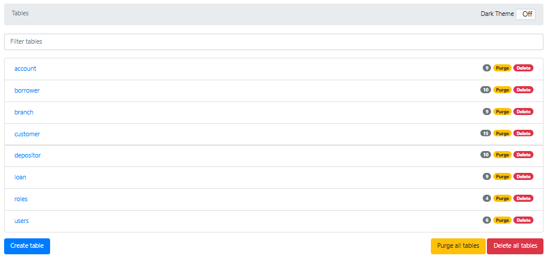
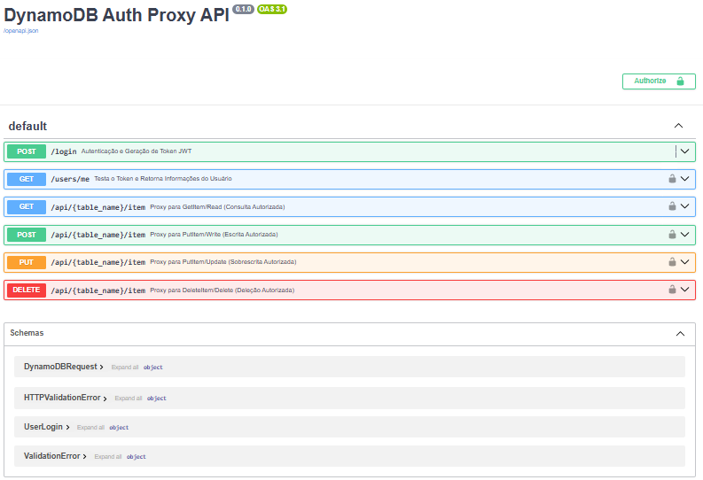
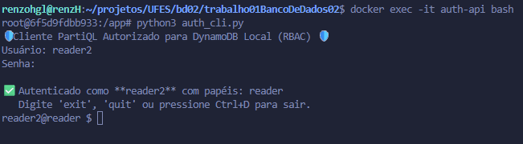

# 🛡️ Sistema de Autenticação e Autorização (RBAC) com DynamoDB local

## 📖 Descrição do Projeto

Este repositório contém um serviço para gerenciamento de dados, utilizando o **DynamoDB** (localmente) para persistência. O sistema implementa um modelo de **Controle de Acesso Baseado em Papéis (RBAC - Role-Based Access Control)**, incluindo autenticação, autorização e verificação de privilégios sobre operações AWS CLI.

O objetivo é simular, em ambiente local, um controle de acesso semelhante ao IAM da AWS, permitindo:

- Usuários com login e senha
- Papéis (roles) com permissões definidas
- Autorização antes da execução de qualquer operação DynamoDB
- Auditoria e bloqueio de ações não autorizadas

### 🔑 Funcionalidades Principais

* **Autorização Dinâmica:** Validação de permissões (`table:action`, ex.: `customer:read`) baseada no papel do usuário, consultadas diretamente nas tabelas de configuração (`roles`).
* **Tabelas de Configuração:** Gerenciamento isolado das tabelas sensíveis (`users` e `roles`).
* **Testes de Segurança:** Suíte completa de testes de integração (`pytest`) com 46 casos de teste que validam toda a matriz de autorização (CRUD e acesso sensível).

---

### 🔍 Operações Disponíveis

As tabelas abaixo resumem as operações suportadas e como são classificadas internamente para fins de autorização (mapeamento **table:action**):

#### 1. Operações **CRUD**
| Operação DynamoDB    | Sintaxe (CLI)  | Ação RBAC     | Descrição                                             |
| -------------------- | --------------------------- | --------- | ----------------------------------------------------- |
| **get-item**         | `dynamodb get-item`         | `read`   | Lê um item específico por chave primária.             |
| **query**            | `dynamodb query`            | `read`    | Consulta por chave de partição com filtros opcionais. |
| **scan**             | `dynamodb scan`             | `read`    | Varre a tabela inteira, retornando todos os itens.    |
| **put-item**         | `dynamodb put-item`         | `write`   | Insere um novo item ou substitui um existente.        |
| **update-item**      | `dynamodb update-item`      | `update`  | Atualiza atributos de um item existente.              |
| **delete-item**      | `dynamodb delete-item`      | `delete`  | Remove um item da tabela.                             |


## 🚀 Como Executar o Projeto Localmente

Para iniciar o ambiente, você precisará ter o **Docker** e o **Docker Compose** instalados.

### 1. Inicialização do Ambiente

O arquivo `docker-compose.yml` inicia a API (`auth-cli`) e uma instância local do DynamoDB (DynamoDB Local) com o setup inicial de dados (usuários e papéis).


```bash
docker compose up --build
```

- A versão admin estará acessível em http://localhost:8001.


|  |
|:---------------------------------:|
| *Captura de tela do painel admin, permitindo CRUDE em todas as tabelas* |


- A documentação interativa da API (Swagger UI) está em http://localhost:8080/docs.


|  |
|:---------------------------------:|
| *Captura de tela da documentação interativa* |


## 🔐 Exemplos de Autenticação e Privilégios TODO:: consertar essa seção

### Papéis e Credenciais de Teste
| Papel | Username | Senha | Permissões nas Tabelas de dados | Permissões nas tabelas `users`/`roles` |
| :--- | :--- | :--- | :--- | :--- |
| **admin** | `admin1` | `123` | `*` (Acesso Total) | `*` (Acesso Total) |
| **writer** | `writer1` | `123` | `write`, `update`, `delete`, `read` | Nenhuma (`403 Forbidden`) |
| **reader** | `reader1` | `123` | `read` | Nenhuma (`403 Forbidden`) |

## 1. Container da API com autorização
Execute o comando a seguir para entrar no container da API e executar o cliente para realização dos testes.

```
docker exec -it auth-cli python3 main.py
```

Faça login e execute comandos DynamoDB conforme exemplo abaixo.


|  |
|:---------------------------------:|
| *Captura de tela de um exemplo de execução* |


Após login, os testes podem ser feitos a partir de consultas na sintaxe *aws dynamodb*

## 3. Exemplos do **reader**


### Reader - GET
```
dynamodb get-item --table-name branch --key '{"branch_name": {"S": "North Town"}}'
```
#### Resposta:
```
   [Autorizado] Permissão 'branch:read' concedida. Executando 'get-item'...

--- Resultado (Deserializado) ---
{'branch_city': 'Rye', 'branch_name': 'North Town', 'assets': Decimal('3700000')}   
----------------------------------
```
### Reader - POST proibido
```
dynamodb put-item --table-name customer --item '{"customer_name":{"S":"TestUserCLI"}, "customer_city":{"S":"CLI-City"}}'
```
#### Resposta:
```
❌ ERRO DE AUTORIZAÇÃO: O usuário 'reader1' (papel: reader) não tem a permissão **'customer:write'** necessária.
----------------------------------
```

## 4. Exemplos do **writer** (CRUDE)


### Writer - Insert
```
dynamodb put-item --table-name customer --item '{"customer_name":{"S":"TestUserCLI"}, "customer_city":{"S":"CLI-City"}}'
```


### Writer - GET
```
dynamodb get-item --table-name customer --key '{"customer_name": {"S": "TestUserCLI"}}'
```
#### Resposta:
```
   [Autorizado] Permissão 'customer:read' concedida. Executando 'get-item'...

--- Resultado (Deserializado) ---
{'customer_name': 'TestUserCLI', 'customer_city': 'CLI-City'}
----------------------------------
```

### Writer - UPDATE
```
dynamodb update-item --table-name customer --key '{"customer_name":{"S":"TestUserCLI"}}' --update-expression "SET customer_city = :c" --expression-attribute-values '{":c":{"S":"CLI-Updated"}}'

```

### Writer - GET
```
dynamodb get-item --table-name customer --key '{"customer_name": {"S": "TestUserCLI"}}'
```
#### Resposta:
```
   [Autorizado] Permissão 'customer:read' concedida. Executando 'get-item'...

--- Resultado (Deserializado) ---
{'customer_name': 'TestUserCLI', 'customer_city': 'CLI-Updated'}
----------------------------------
```

### Writer - DELETE
```
dynamodb delete-item --table-name customer --key '{"customer_name":{"S":"TestUserCLI"}}'

```

### Writer - GET
```
dynamodb get-item --table-name customer --key '{"customer_name": {"S": "TestUserCLI"}}'
```
#### Resposta:
```
   [Autorizado] Permissão 'customer:read' concedida. Executando 'get-item'...

✅ Comando executado com sucesso (sem retorno específico de item).

```


## 5. Exemplos do **writer** — Tabelas sensíveis (users e roles)

### Users
```
dynamodb get-item --table-name users --key '{"username": {"S": "reader1"}}'
```
#### Resposta:
```
❌ ERRO DE AUTORIZAÇÃO: O usuário 'writer1' (papel: writer) não tem a permissão **'users:read'** necessária.
----------------------------------
```

### Roles
```
dynamodb get-item --table-name roles --key '{"role_name": {"S": "reader"}}'
```
#### Resposta:
```
❌ ERRO DE AUTORIZAÇÃO: O usuário 'writer1' (papel: writer) não tem a permissão **'roles:read'** necessária.
----------------------------------
```

## 🧪 Instruções de Uso e Testes (Pytest)

### 1. Executando a Suíte de Testes

Execute a suíte completa de testes de integração dentro do contêiner da API. Estes testes validam todas as permissões de crude, além da permissão das tabelas sensíveis que representam as restrições de acesso (**users**, **roles**).

Esses testes tem como objetivo verificar se os papéis (**reader**, **writer** e **admin**) possuem as permissões corretas (READ, WRITE, UPDATE, DELETE) na tabela de dados padrão **customer** e nas tabelas sensíveis (**users** e **roles**), garantindo o correto funcionamento do módulo de autorização da **API*.

```
docker exec -it auth-cli pytest ./test_auth.py
```


### Cobertura dos testes por tipo de operação

#### Testes de Autorização na Tabela customer (CRUD)

| Papel      | Ação   | Resultado Esperado    | Justificativa                            |
| ---------- | ------ | --------------------------- | --------------------- | ---------------------------------------- |
| **reader** | read   | ✔ Autorizado          | reader possui `customer:read`.           |
| **reader** | write  | ❌ Erro de Autorização | reader **não** possui `customer:write`.  |
| **reader** | update | ❌ Erro de Autorização | reader **não** possui `customer:update`. |
| **reader** | delete | ❌ Erro de Autorização | reader **não** possui `customer:delete`. |
| **writer** | read   | ✔ Autorizado          | writer possui `customer:read`.           |
| **writer** | write  | ✔ Autorizado          | writer possui `customer:write`.          |
| **writer** | update | ✔ Autorizado          | writer possui `customer:update`.         |
| **writer** | delete | ✔ Autorizado          | writer possui `customer:delete`.         |
| **admin**  | read   | ✔ Autorizado          | admin possui coringa `*`.                |
| **admin**  | write  | ✔ Autorizado          | admin possui coringa `*`.                |
| **admin**  | update | ✔ Autorizado          | admin possui coringa `*`.                                |

#### Testes de Acesso às Tabelas Sensíveis (users e roles)

1. Reader

| Ação   | Tabela | Resultado Esperado    | Justificativa                          |
| ------ | ------ | --------------------- | -------------------------------------- |
| read   | users  | ❌ Erro de Autorização | reader não possui permissão `users:*`. |
| write  | users  | ❌ Erro de Autorização | reader não possui permissão `users:*`. |
| update | users  | ❌ Erro de Autorização | reader não possui permissão `users:*`. |
| delete | users  | ❌ Erro de Autorização | reader não possui permissão `users:*`. |
| read   | roles  | ❌ Erro de Autorização | reader não possui permissão `roles:*`. |
| write  | roles  | ❌ Erro de Autorização | reader não possui permissão `roles:*`. |
| update | roles  | ❌ Erro de Autorização | reader não possui permissão `roles:*`. |
| delete | roles  | ❌ Erro de Autorização | reader não possui permissão `roles:*`. |

2. Writer

| Ação   | Tabela | Resultado Esperado    | Justificativa                          |
| ------ | ------ | --------------------- | -------------------------------------- |
| read   | users  | ❌ Erro de Autorização | writer não possui permissão `users:*`. |
| write  | users  | ❌ Erro de Autorização | writer não possui permissão `users:*`. |
| update | users  | ❌ Erro de Autorização | writer não possui permissão `users:*`. |
| delete | users  | ❌ Erro de Autorização | writer não possui permissão `users:*`. |
| read   | roles  | ❌ Erro de Autorização | writer não possui permissão `roles:*`. |
| write  | roles  | ❌ Erro de Autorização | writer não possui permissão `roles:*`. |
| update | roles  | ❌ Erro de Autorização | writer não possui permissão `roles:*`. |
| delete | roles  | ❌ Erro de Autorização | writer não possui permissão `roles:*`. |

3. Admin

| Ação   | Tabela | Resultado Esperado    | Justificativa                          |
| ------ | ------ | --------------------- | -------------------------------------- |
| read   | users  | ✔ Autorizado          | admin possui coringa `*`.              |
| write  | users  | ✔ Autorizado          | admin possui coringa `*`.              |
| update | users  | ✔ Autorizado          | admin possui coringa `*`.              |
| delete | users  | ✔ Autorizado          | admin possui coringa `*`.              |
| read   | roles  | ✔ Autorizado          | admin possui coringa `*`.              |
| write  | roles  | ✔ Autorizado          | admin possui coringa `*`.              |
| update | roles  | ✔ Autorizado          | admin possui coringa `*`.              |
| delete | roles  | ✔ Autorizado          | admin possui coringa `*`.              |

#### Teste de Autenticação Inválida

| Usuário         | Senha         | Resultado Esperado    | Justificativa                                                       |
| --------------- | ------------- | --------------------- | ------------------------------------------------------------------- |
| nonexistentuser | wrongpassword | ❌ Autenticação falhou | Credenciais inválidas devem bloquear o acesso antes da autorização. |


## Licença
Distribuído por meio da licença GNU. Veja [LICENSE](./LICENSE) para mais informações.